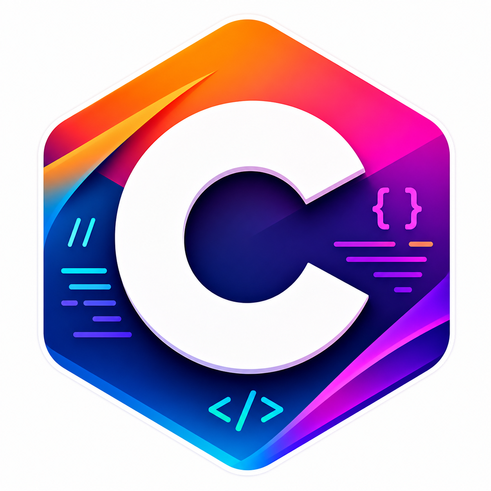

<h1 align="center">C Programming – Practical File</h1>

<p align="center">
  
</p>

<p align="center">
  <b>👨‍💻 By Golu Kumar Singh</b><br>
  <i>Building strong programming fundamentals, one program at a time.</i>
</p>

---

## 🚀 About This Repository

This repository contains all the laboratory programs completed during **Semester 2** for the **Fundamentals in C Programming** course.

It is designed as a **hands-on learning collection**, focusing on understanding core programming concepts through clear and structured implementations in C.

---

## 📘 Course Information

- 🎓 **Course:** Fundamentals in C Programming  
- 📅 **Semester:** II  
- 💡 **Language:** C  
- 🛠️ **Tools:** GCC / Code::Blocks  
- 📆 **Session:** 2025–2026  

---

## 🧪 Practicals Breakdown

Each practical focuses on a specific concept to strengthen problem-solving and coding skills:

### 🔹 1. Introduction to C
Set up the development environment and run your first *Hello, World!* program.

### 🔹 2. Input & Output
Learn how to take input and display output using `scanf` and `printf`.

### 🔹 3. Basic Arithmetic
Add two numbers and display the result.

### 🔹 4. Circle Calculations
Compute **area** and **circumference** using user input.

### 🔹 5. Arithmetic Operations
Perform all basic operations: ➕ ➖ ✖️ ➗

### 🔹 6. Mathematical Expressions
Evaluate formulas involving algebra and square roots.

### 🔹 7. Swapping Variables
Swap values:
- With a temporary variable  
- Without using extra space  

### 🔹 8. Decision Making
Find the greatest among three numbers using:
- If-Else  
- Ternary Operator  

### 🔹 9. Control Structures (Switch Case)
- Identify vowels and consonants  
- Classify numbers (positive, negative, zero)  

### 🔹 10. Looping Concepts
Use loops to compute the sum of first *n* natural numbers.

---

## ⚙️ How to Compile & Run

Use GCC compiler:

```bash
gcc filename.c -o output
./output
```

---

## 📌 Key Highlights

✨ Beginner-friendly implementations  
🧠 Focus on logic building  
📂 Clean and structured programs  
🚀 Ideal for academic and revision purposes  

---

## 📝 Final Note

This repository is not just a submission—it's a **foundation for future programming growth**.  
Feel free to explore, modify, and build upon these programs.

---

<p align="center">
  ⭐ If you found this useful, consider starring the repo!
</p>
